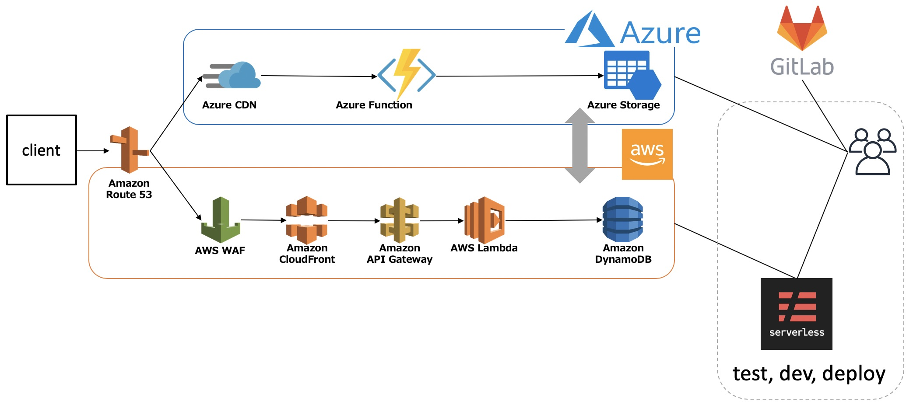
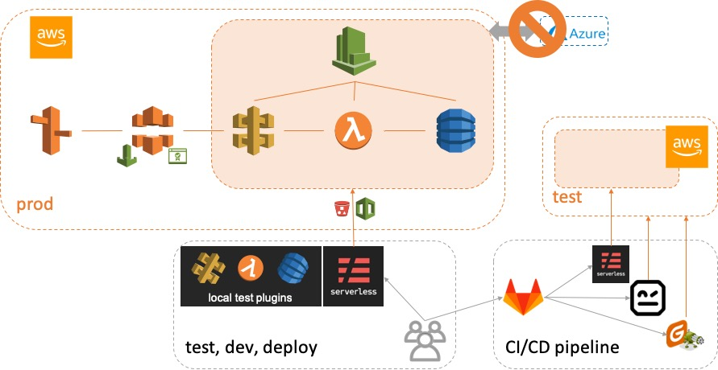
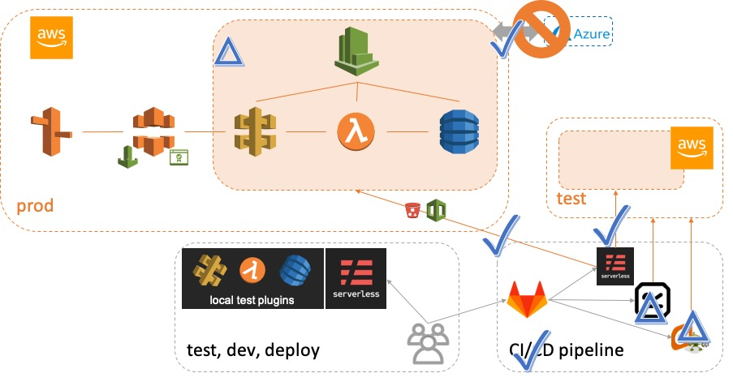
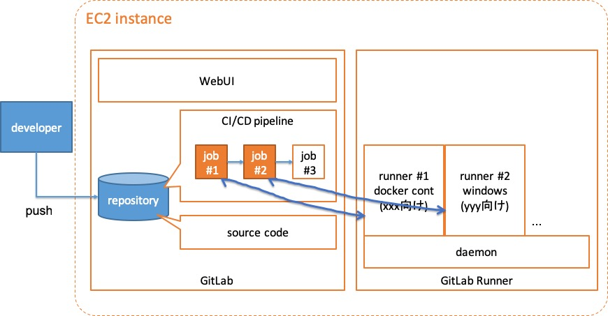
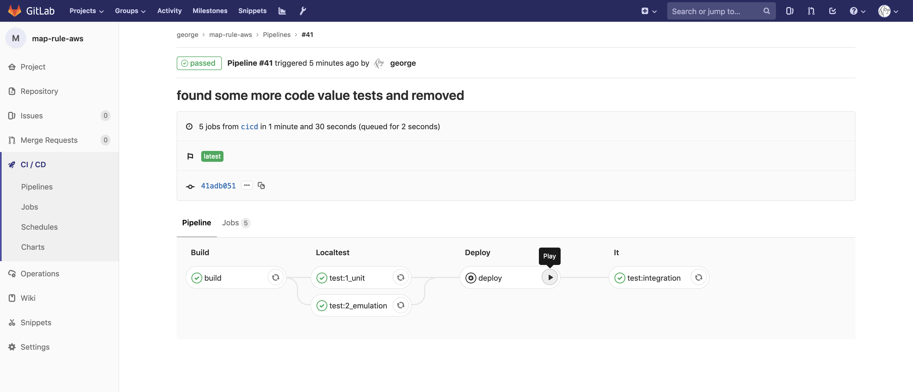

---?image=assets/img/yamaki2.jpg
@title[toppage]

# 開発合宿
おわったよ！

2019/02/25-27 @ 山喜旅館

[george](https://github.com/take4mats/201902techcamp)

---

## 今回のゴール設定

---

### テーマ
Serverless x CI/CD

---

### これを (現状)



---

### こうしたい (目標)



+++

### いろいろ工夫して (1/2)
- CI/CD パイプラインを gitlab で組む
  1. unit test ?
  2. deployment by serverless framework
  3. scenario test by Robot Framework w/ RESTinstance
  4. stress test by Gatling ?

+++

### いろいろ工夫して (2/2)
- remove Azure
- refactor AWS
  - resolve "hell of callback"
  - other tweak

---

### 出来たこと (image)



+++

### 出来たこと (summary)
- (GitLab + GitLab-Runner) on EC2
- CI/CD pipeline の構築 (build, local test, deploy, integration test)
- 実コードのリファクタリング

+++

### GitLab + GitLab-Runner



+++

### CI/CD pipeline (screenshot)


+++

### CI/CD pipeline (コードのボリューム)
```
image: georgeorge/sls-centos:v8.10.0
variables:
    AWS_REGION: ap-northeast-2
    PROFILE: default
    STAGE: test

stages:  # define stages sequencially
    - build
    - localtest
    - deploy
    - it

build:
    stage: build
    tags:
        - map-rule
    script:
        - cp operation/environment_cicd.js operation/environment.js
        - npm install
    artifacts:
        paths:
            - operation/environment.js
            - node_modules/

test:1_unit:  # define job called 'unittest'
    stage: localtest
    tags:
        - map-rule
    script:
        - echo 'fake unit test is done'

test:2_emulation:  # define job called 'emulationtest'
    stage: localtest
    tags:
        - map-rule
    script:
        - sls dynamodb install --profile ${PROFILE} --region ${AWS_REGION} --stage ${STAGE}
        - sls dynamodb start --profile ${PROFILE} --region ${AWS_REGION} --stage ${STAGE}
        - sls offline --profile ${PROFILE} --region ${AWS_REGION} --stage ${STAGE} &
        - npm run test test/index.test.js

deploy:  # define job called 'deploy'
    stage: deploy
    tags:
        - map-rule
    script:
        - sls deploy --region ${AWS_REGION} --stage ${STAGE}
    # when: manual
    # allow_failure: false

test:integration:  # define a job for integration test
    stage: it
    tags:
        - map-rule
    script:
        - 'curl -H "x-api-key: testxapikey" "https://fia57dsty0.execute-api.ap-northeast-2.amazonaws.com/test/?code=testcode&ipv6Prefix=2400:4050::&ipv6PrefixLength=56"'
```

+++

### リファクタリング
- 予定していた Azure の切り離し
- Node.js バージョンアップ
  - async/await を導入して非同期処理を改善しようとしたが未完成

---

### 振り返って
- docker image: 苦戦したが、一度作れば本当にいろいろ捗る (immutable で環境が汚れない)
- gitlab はツールチェインとしてかなり機能が多い (CI/CD pipeline 早速導入しよう)
- 承認ボタン相当も作れるので、 **導入判断** (≒方式調整) もここで回せる！？

---

# おわり